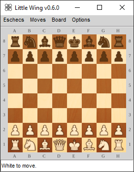

*Eschecs* est un programme de jeu d'échecs utilisant le [protocole UCI](http://www.shredderchess.com/chess-info/features/uci-universal-chess-interface.html) pour dialoguer avec des joueurs d'échecs artificiels.



## I. Guide de l'utilisateur

### A. Déplacement des pièces

Pour déplacer une pièce, faites-la glisser avec la souris jusqu'à la case d'arrivée.

### B. Adversaire artificiel

Au lancement de l'application, un moteur par défaut est chargé. Vous pouvez choisir un autre adversaire dans la liste des modules (menu "Coups").

### C. Modes de jeu

Par défaut, l'utilisateur a les blancs et l'ordinateur les noirs. Si vous souhaitez que l'ordinateur prenne les blancs, cliquez sur "Coup de l'ordinateur", dans le menu "Coups".

Pour jouer humain contre humain, décochez l'option "Réponse automatique", dans le menu "Coups".

### E. Contrôles clavier

    ↑   Aller à la dernière position
    ↓   Aller à la première position
    ←   Aller à la position précédente
    →   Aller à la position suivante
    ESC Quitter le programme

## I. Guide de l'utilisateur avancé

### A. Installer un nouveau moteur UCI.

Pour installer un nouveau moteur UCI, vous devez éditer le fichier **eschecs.eng**, qui se trouve dans le répertoire **config**.

### B. Protocole.

*Eschecs* utilise le protocole UCI.

Pour la commande "go", *Eschecs* utilise la syntaxe suivante :

    go movetime 1000

Vous pouvez changer la valeur du paramètre en éditant le fichier **eschecs.ini**, qui se trouve dans le répertoire **config**.

Vous pouvez aussi lancer *Eschecs* au moyen de l'application *Options*.

## III. Guide du programmeur

### A. Compilation

*Eschecs* est un programme pour le compilateur Free Pascal.

*Eschecs* utilise les bibliothèques [fpGUI][1], [BGRABitmap][2] et [uos][3].

Il ya trois manières de compiler *Eschecs*.

Vous pouvez utiliser le fichier de commandes *build.cmd* (sous Windows) ou *build.sh* (sous Linux). Free Pascal doit être installé sur votre ordinateur.

Vous pouvez aussi utiliser les fichiers projet [Lazarus](https://sourceforge.net/projects/lazarus/) *eschecs.lpi* et *options.lpi*. Il y a, en effet, deux applications à compiler.

Vous pouvez enfin utiliser les fichiers projet [MSEide](https://sourceforge.net/projects/mseide-msegui/) *eschecs.prj* et *options.prj*.

### B. Installation des fichiers binaires de la bibliothèque uos

Une fois que vous avez compilé l'application, vous devez vous procurer les fichiers binaires de la bibliothèque utilisée pour le son, et de les placer dans le dossier *audio*, comme ceci.

```
+---audio
|   +---lib
|   |   +---Linux
|   |   \---Windows
```

Vous pouvez télécharger ces fichiers binaires [ici](https://github.com/fredvs/uos/releases/).

Si vous ne vous souciez pas d'entendre des sons, vous pouvez passer ignorer cette étape.

## IV. Crédits

### A. Graphisme.

L'échiquier en bois et ses pièces sont l'œuvre de [Daniela Di Lena](https://dilena.de/chess-artwork-pieces-and-board-art-assets).

L'icône d'*Eschecs* vient de la police [Chess Montreal](http://alcor.concordia.ca/~gpkatch/montreal_font.html). *Chess Montreal* est une police de caractères de Gary Katch.

*Chess Alpha* est une police de caractères d'Eric Bentzen. *Chess Condal, Chess Line, Chess Mark* sont des polices de caractères d'Armando Marroquin.

### B. Effets sonores.


### C. Moteurs.

*Fruit 2.1* est un programme d'échecs de Fabien Letouzey. *Moustique* est un programme d'échecs de Roland Chastain, basé sur *Schachspiel* de Jürgen Schlottke.

### D. Bibliothèques.

[fpGUI](https://github.com/graemeg/fpGUI) est une bibliothèque multiplateforme de Graeme Geldenhuys, pour la réalisation d'applications graphiques en Pascal.

[BGRABitmap](https://github.com/bgrabitmap/bgrabitmap) est une bibliothèque pour le graphisme écrite pour le compilateur Free Pascal par Johann Elsass.

[uos](https://github.com/fredvs/uos) est une collection de bibliothèques pour le son, avec des procédures unifiées écrites pour Free Pascal par Fred van Stappen.

Merci à John Bennett ainsi qu'à Norbert Raimund Leisner pour le logo de Moustique. C'est l'image d'un avion, le Farman F455 Moustique.

## V. Auteur

*Eschecs* est un programme en Pascal écrit par Roland Chastain, avec des contributions de Johann Elsass et de Fred van Stappen.

[1]: https://github.com/graemeg/fpGUI 
[2]: https://github.com/bgrabitmap/bgrabitmap
[3]: https://github.com/fredvs/uos
[Fritz 1.0]: http://www.top-5000.nl/cp.htm
